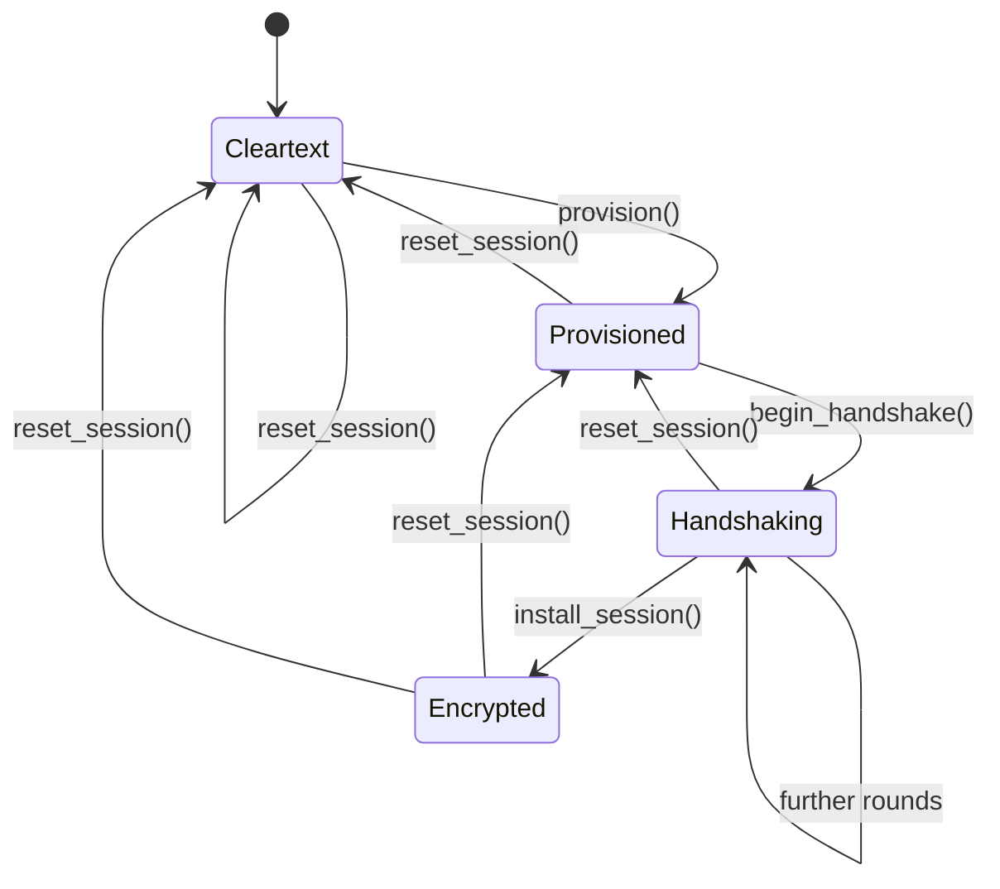
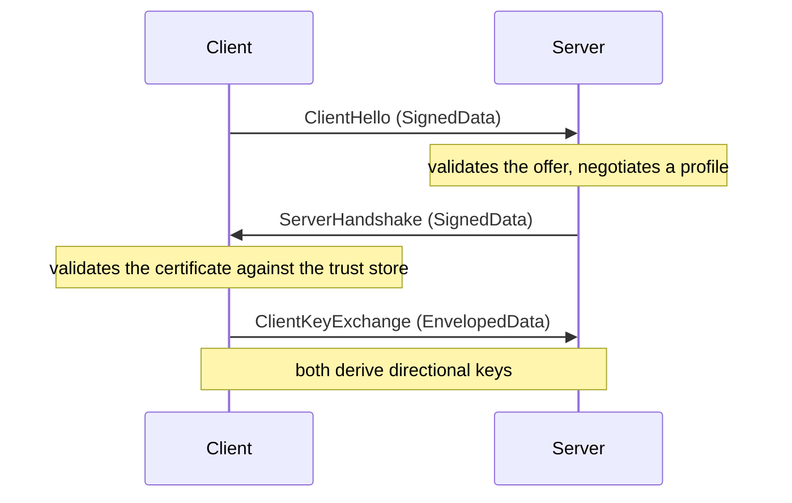
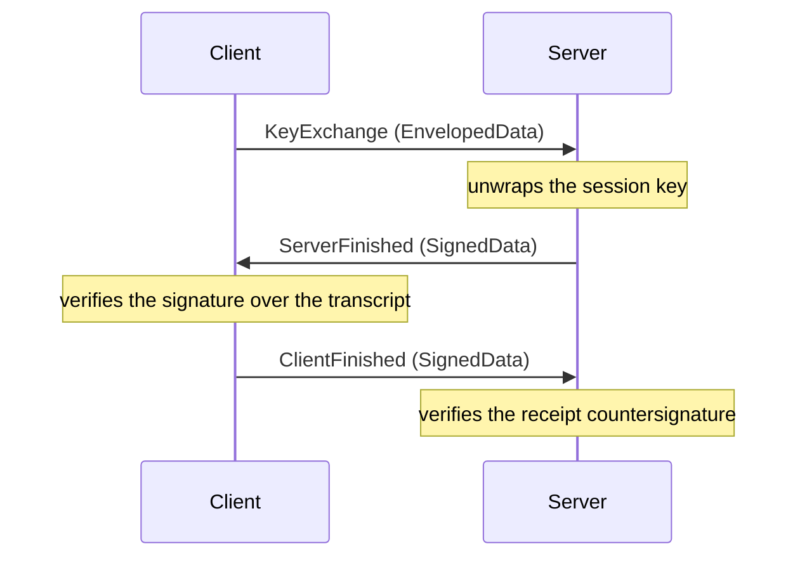
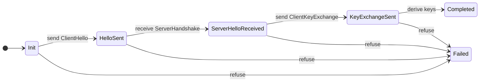
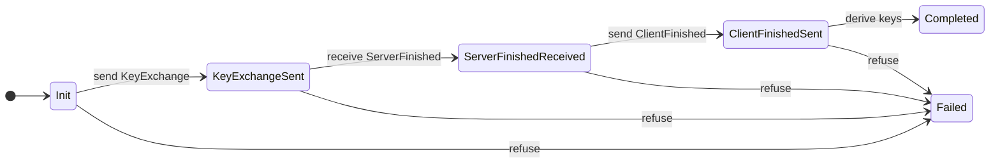
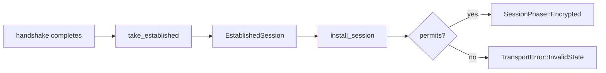
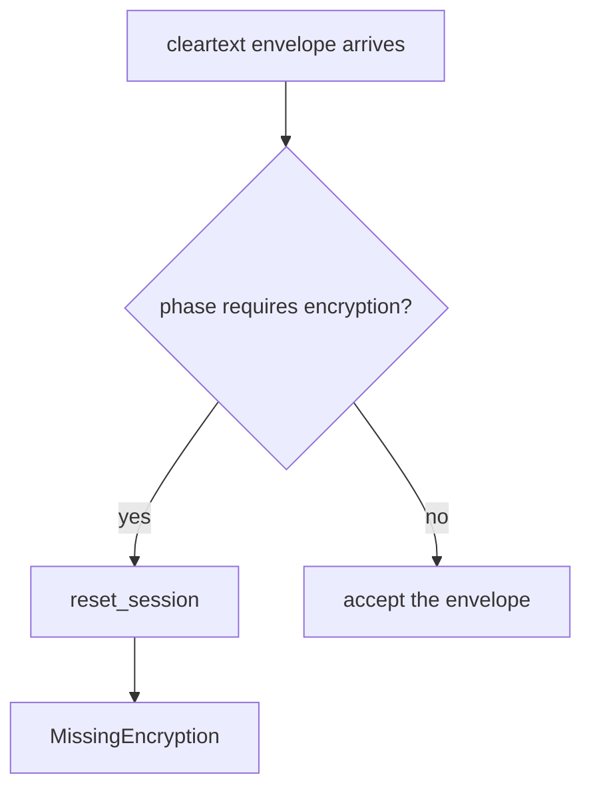

# The TightBeam Handshake

This document describes how a TightBeam session is established, which types carry that work, and which states the design refuses to represent. It covers the transport and handshake layers as they stand after the Phase 4 remediation.

## Contents

- [Two protocols, one seam](#two-protocols-one-seam)
- [The session phase](#the-session-phase)
- [Message flow](#message-flow)
- [Handshake state machines](#handshake-state-machines)
- [Completion](#completion)
- [Peer authentication](#peer-authentication)
- [Transcript binding](#transcript-binding)
- [Failure and the circuit breaker](#failure-and-the-circuit-breaker)

## Two protocols, one seam

TightBeam ships two handshake backends. ECIES is the lighter one and tunnels its own message types inside CMS containers. CMS exchanges those containers directly as a key-transport handshake, so the client encrypts the session key to the server's certificate in its first message.

Both backends meet the transport at one seam, so the driver moves a handshake message without knowing which protocol produced it.

```rust
pub enum HandshakeMessage {
    /// Carries an ECIES `ClientHello` or `ServerHandshake`, or a CMS Finished.
    SignedData(Box<SignedData>),
    /// Carries an ECIES `ClientKeyExchange`, or a CMS key exchange.
    EnvelopedData(Box<EnvelopedData>),
}
```

Each step accepts one container and refuses the other. A step asks for the one it expects, and a peer that sends the other receives `HandshakeError::UnexpectedContainer`.

```rust
let key_exchange = msg.enveloped()?;   // refuses a SignedData
let finished = msg.signed()?;          // refuses an EnvelopedData
```

Because the orchestrator names its own container, the driver carries no per-protocol mapping. `ClientBuilder`, the connection pool and the `client!` macro all reach the same code.

## The session phase

A transport holds one `SessionPhase`. The phase is the single record of where a session sits, and once encrypted it carries everything the handshake agreed.

```rust
pub enum SessionPhase {
    Cleartext,
    Provisioned,
    Handshaking { initiated_at: HandshakeInstant },
    Encrypted(Box<EstablishedSession>),
}
```

Carrying the session inside the phase means a half-installed session cannot be represented, and leaving the phase drops every term together.



`SessionPhase::permits` holds this table, and every transition consults it before writing. A move the table does not name leaves the session where it was and reports `false`, so a driver that attempts an out-of-order transition fails with `TransportError::InvalidState` rather than proceeding.

| Attempted move             | Result  | Reason                                 |
| -------------------------- | ------- | -------------------------------------- |
| `Cleartext -> Encrypted`   | Refused | No handshake ran                       |
| `Encrypted -> Handshaking` | Refused | A live session's keys would be dropped |
| `Encrypted -> Encrypted`   | Refused | Keys would be replaced silently        |
| `Provisioned -> Encrypted` | Refused | The handshake never started            |

## Message flow

ECIES exchanges three messages. The server answers the hello with its certificate and a signature, and the client replies with the encrypted session material.



CMS exchanges three messages as well, but the client leads with the key exchange because the session key travels encrypted to the server's certificate.



The CMS server settles the receipt in the same round that receives the client Finished, so a budget-bearing session activates only after the countersignature verifies.

## Handshake state machines

Each protocol supplies its own transition table through a sealed trait, so a CMS peer cannot take an ECIES edge.

```rust
pub trait HandshakeFlow: sealed::Sealed {
    fn client_permits(from: ClientHandshakeState, to: ClientHandshakeState) -> bool;
    fn server_permits(from: ServerHandshakeState, to: ServerHandshakeState) -> bool;
}
```

The ECIES client machine runs the hello first.



The CMS client machine leads with the key exchange.



Any state may reach `Aborted` or `Failed`, which are the terminals a refusal lands on. Every other edge is the one the table names, so an out-of-order message returns `HandshakeError::InvalidState`.

| Backend | Client sequence                                                              | Server sequence                                                                  |
| ------- | ---------------------------------------------------------------------------- | -------------------------------------------------------------------------------- |
| ECIES   | Init, HelloSent, ServerHelloReceived, KeyExchangeSent, Completed             | Init, ClientHelloReceived, ServerHelloSent, KeyExchangeReceived, Completed       |
| CMS     | Init, KeyExchangeSent, ServerFinishedReceived, ClientFinishedSent, Completed | Init, KeyExchangeReceived, ServerFinishedSent, ClientFinishedReceived, Completed |

## Completion

A completed handshake hands over everything it agreed in one value. The orchestrator is consumed, so the terms are read once and a spent handshake cannot answer another call.

```rust
pub struct EstablishedSession {
    keys: SessionKeys,
    mux: Option<MuxSettings>,
    receipt: Option<Arc<StoredReceipt>>,
    peer: Option<Arc<Certificate>>,
    epoch: Option<EpochMaterials>,
}
```

The fields are private, so outside the crate the session answers named questions instead: `keys()`, `mux()`, `receipt()` and `peer()`.

Each orchestrator exposes one completion, and the protocol trait delegates to it. A driver and a test therefore read the session terms the same way.

```rust
// The single home for CMS client completion.
let session = client.take_established()?;

// Through the trait, which consumes the boxed orchestrator.
let session = ClientHandshakeProtocol::complete(client).await?;
```

Installing that session is one phase write.

```rust
fn install_session(&mut self, session: EstablishedSession) -> bool {
    self.advance_phase(SessionPhase::Encrypted(Box::new(session)))
}
```

The certificate and the receipt travel as `Arc`, so completion copies neither.



## Peer authentication

A client identity proves who the client is and says nothing about the server. Only a trust store answers for the peer, so a client that presents an identity without one is refused before any frame reaches the wire.

```rust
pub fn check_peer_authentication(&self) -> TransportResult<()> {
    if self.has_client_identity() && !self.authenticates_peer() && !self.allow_cleartext {
        return Err(TransportError::PeerAuthenticationUnconfigured);
    }

    Ok(())
}
```

`apply_wire_mode` consults this before it produces a cleartext envelope, so the builder, the connection pool, the colony dialers and the `client!` macro are all covered by one check.

A frame reaches the wire through one of three places, and each carries the decision already made:

| Writer | What closes it |
| --- | --- |
| `apply_wire_mode` | Reads the phase, and runs the peer-authentication check before a cleartext envelope |
| `TransportWriter` | Holds keys taken from an `Encrypted` phase, so the session is already established |
| `CleartextWriter` | Obtainable only from a transport carrying no encryption material |

Running without authenticating the peer stays available as a named choice.

```rust
let client = ClientBuilder::<TokioListener>::builder()
    .allow_cleartext()
    .build()
    .connect(addr)
    .await?;
```

| Configuration                          | Reaches the wire | Reason                                        |
| -------------------------------------- | ---------------- | --------------------------------------------- |
| Trust store                            | Yes              | The peer is authenticated                     |
| Client validators                      | Yes              | A mutual-auth server authenticates its client |
| Server certificate                     | Yes              | A server presents its own identity            |
| Client identity alone                  | No               | Nothing establishes who the peer is           |
| Client identity plus `allow_cleartext` | Yes              | The risk is named                             |

## Transcript binding

The CMS transcript hashes the container DER on both sides. The sender hashes what it encoded and the receiver hashes what it received, so the two agree only while the encoding round-trips.

This binding is value-level rather than byte-level. The pinned `der` decoder sorts a `SET OF` before validating it, so a mis-ordered set is normalised and accepted rather than rejected. Both endpoints therefore hash the canonical form of the same parsed value, and the handshake stays correct. What is lost is byte-level tamper evidence for set ordering, which is recorded as finding U-107.

## Failure and the circuit breaker

`reset_session` returns a session to its start. Because the phase carries the session, the reset drops the keys, the receipt, the peer certificate, the mux terms and the epoch materials together.



This matters for authorization. The colony gates and the cluster export rules read the peer certificate, so a session that was torn down must not leave the previous peer's identity readable.

An end of stream is named by the phase it interrupted. A peer that disconnects while a handshake is pending gives `PeerClosedBeforeHandshake`, and the same event on an agreed session gives `ConnectionClosed`, which is what a pool acts on when it evicts a connection.

# Sources

- RFC 5652, Cryptographic Message Syntax: <https://datatracker.ietf.org/doc/html/rfc5652>
- RFC 5280, Internet X.509 Public Key Infrastructure Certificate and CRL Profile: <https://datatracker.ietf.org/doc/html/rfc5280>
- CWE-295, Improper Certificate Validation: <https://cwe.mitre.org/data/definitions/295.html>
- CWE-311, Missing Encryption of Sensitive Data: <https://cwe.mitre.org/data/definitions/311.html>
- CWE-345, Insufficient Verification of Data Authenticity: <https://cwe.mitre.org/data/definitions/345.html>
