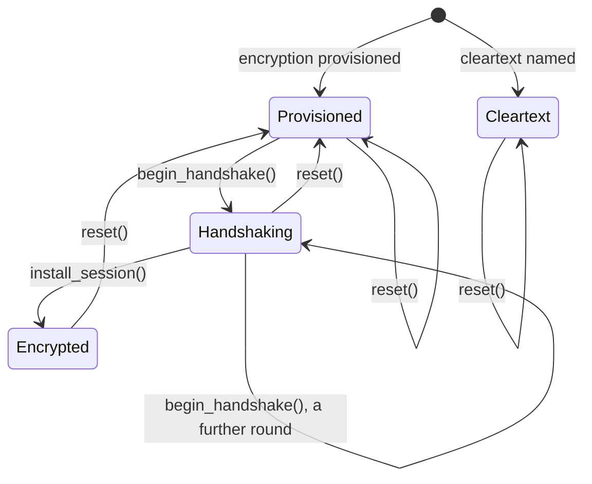
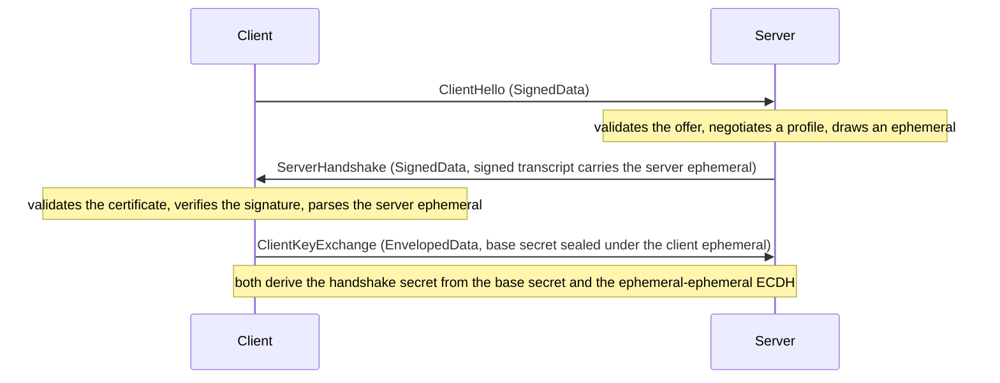
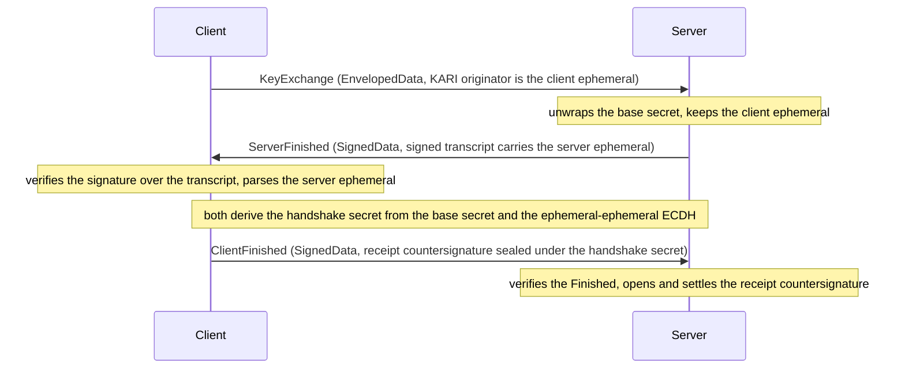
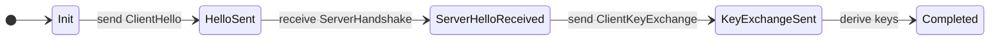
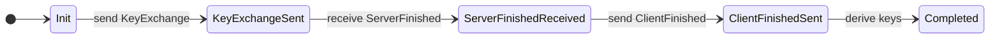
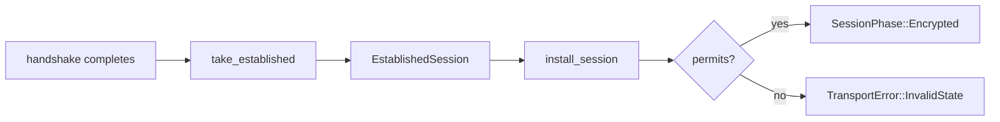
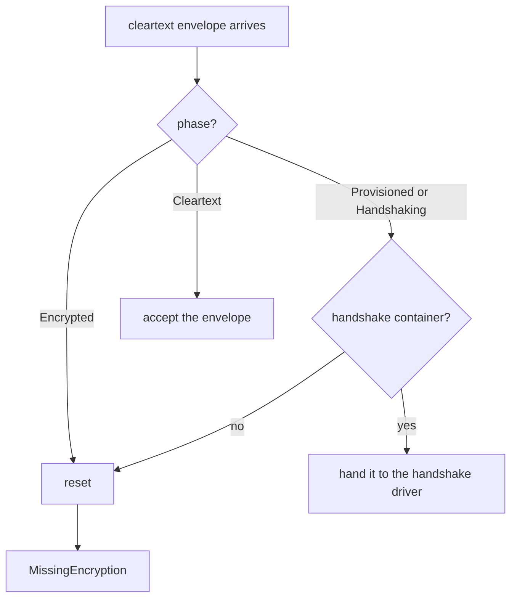

# The TightBeam Handshake

This document describes how a TightBeam session is established, which types carry that work, and which states the design refuses to represent. It covers the transport and handshake layers.

## Contents

- [Two protocols, one interface](#two-protocols-one-interface)
- [The session phase](#the-session-phase)
- [Message flow](#message-flow)
- [Handshake state machines](#handshake-state-machines)
- [Completion](#completion)
- [Peer authentication](#peer-authentication)
- [Key schedule](#key-schedule)
- [Transcript binding](#transcript-binding)
- [Failure and the circuit breaker](#failure-and-the-circuit-breaker)

## Two protocols, one interface

TightBeam ships two handshake backends.

| Backend | Messages                                              | The client's first message                                                   |
| ------- | ----------------------------------------------------- | ---------------------------------------------------------------------------- |
| ECIES   | Its own message types, tunneled inside CMS containers | `ClientHello`                                                                |
| CMS     | CMS containers, exchanged directly                    | The key exchange, with the base secret encrypted to the server's certificate |

In both, the session keys derive from the base secret and an ephemeral-ephemeral ECDH. See [Key schedule](#key-schedule).

Both backends meet the transport at one interface, so the driver moves a handshake message without knowing which protocol produced it. Each container travels as a `WireDer`, which keeps the decoded value together with the bytes it was encoded or received as.

```rust
pub enum HandshakeMessage {
    /// Carries an ECIES `ClientHello` or `ServerHandshake`, or a CMS Finished.
    SignedData(Box<WireDer<SignedData>>),
    /// Carries an ECIES `ClientKeyExchange`, or a CMS key exchange.
    EnvelopedData(Box<WireDer<EnvelopedData>>),
}
```

Each step accepts one container and refuses the other. A step asks for the one it expects, and a peer that sends the other receives `HandshakeError::UnexpectedContainer`.

```rust
let key_exchange = msg.enveloped()?;   // refuses a SignedData
let finished = msg.signed()?;          // refuses an EnvelopedData
```

Because the orchestrator names its own container, the driver carries no per-protocol mapping. `ClientBuilder`, the connection pool and the `client!` macro all reach the same code.

## The session phase

A transport holds one `SessionState`, which pairs the endpoint's provisioning with one `SessionPhase`. The phase is the single record of where a session sits, and once encrypted it carries everything the handshake agreed.

```rust
pub enum SessionPhase {
    Cleartext,
    Provisioned,
    Handshaking { initiated_at: MonotonicInstant },
    Encrypted(Box<EstablishedSession>),
}
```

Carrying the session inside the phase means a half-installed session cannot be represented, and leaving the phase drops every term together.

The provisioning fixes where a session starts:

- An endpoint that holds encryption material starts in `Provisioned`.
- An endpoint that named cleartext starts in `Cleartext`.
- A reset always returns the session to that start.

A further handshake round keeps the `initiated_at` of the first round, so a slow peer cannot stretch the handshake deadline by one allowance per round.


```mermaid
stateDiagram-v2
    [*] --> Provisioned: encryption provisioned
    [*] --> Cleartext: cleartext named
    Provisioned --> Handshaking: begin_handshake()
    Handshaking --> Handshaking: begin_handshake(), a further round
    Handshaking --> Encrypted: install_session()
    Encrypted --> Provisioned: reset()
    Handshaking --> Provisioned: reset()
    Provisioned --> Provisioned: reset()
    Cleartext --> Cleartext: reset()
```

`SessionPhase::admits` holds this table. `SessionState::apply` is the one writer of the phase, and it consults the table before it writes.

A move the table does not name leaves the session where it was and returns `false`, so an out-of-order install fails with `TransportError::InvalidState`.

| Attempted move             | Result  | Reason                                     |
| -------------------------- | ------- | ------------------------------------------ |
| `Cleartext -> Handshaking` | Refused | A cleartext endpoint holds no key material |
| `Cleartext -> Encrypted`   | Refused | No handshake ran                           |
| `Encrypted -> Handshaking` | Refused | A live session's keys would be dropped     |
| `Encrypted -> Encrypted`   | Refused | Keys would be replaced silently            |
| `Provisioned -> Encrypted` | Refused | The handshake never started                |

## Message flow

ECIES exchanges three messages. The last one seals the base secret to the server's certificate.


```mermaid
sequenceDiagram
    participant C as Client
    participant S as Server
    C->>S: ClientHello (SignedData)
    Note over S: validates the offer, negotiates a profile, draws an ephemeral
    S->>C: ServerHandshake (SignedData, signed transcript carries the server ephemeral)
    Note over C: validates the certificate, verifies the signature, parses the server ephemeral
    C->>S: ClientKeyExchange (EnvelopedData, base secret sealed under the client ephemeral)
    Note over C,S: both derive the handshake secret from the base secret and the ephemeral-ephemeral ECDH
```

CMS exchanges three messages as well, but the client leads with the key exchange because the base secret travels encrypted to the server's certificate.


```mermaid
sequenceDiagram
    participant C as Client
    participant S as Server
    C->>S: KeyExchange (EnvelopedData, KARI originator is the client ephemeral)
    Note over S: unwraps the base secret, keeps the client ephemeral
    S->>C: ServerFinished (SignedData, signed transcript carries the server ephemeral)
    Note over C: verifies the signature over the transcript, parses the server ephemeral
    Note over C,S: both derive the handshake secret from the base secret and the ephemeral-ephemeral ECDH
    C->>S: ClientFinished (SignedData, receipt countersignature sealed under the handshake secret)
    Note over S: verifies the Finished, opens and settles the receipt countersignature
```

The CMS server settles the receipt in the same step that processes the client Finished, so a budget-bearing session activates only after the countersignature verifies. A refused settlement takes the handshake secret with it, so a replayed Finished has nothing to complete with.

Both protocols negotiate the security profile through one policy, `ProfilePolicy`:

- The server chooses from its configured profiles. A server with none refuses the first message with `NoSupportedProfiles`.
- The client admits the server's selection. It refuses a reply that selects nothing with `InvalidProfileSelection`.

## Handshake state machines

Each protocol supplies its own transition table through a sealed trait, so a CMS peer cannot take an ECIES edge.

```rust
pub trait HandshakeFlow: sealed::Sealed {
    fn client_permits(from: ClientHandshakeState, to: ClientHandshakeState) -> bool;
    fn server_permits(from: ServerHandshakeState, to: ServerHandshakeState) -> bool;
}
```

The ECIES client machine runs the hello first.


```mermaid
stateDiagram-v2
    direction LR
    [*] --> Init
    Init --> HelloSent: send ClientHello
    HelloSent --> ServerHelloReceived: receive ServerHandshake
    ServerHelloReceived --> KeyExchangeSent: send ClientKeyExchange
    KeyExchangeSent --> Completed: derive keys
```

The CMS client machine leads with the key exchange.


```mermaid
stateDiagram-v2
    direction LR
    [*] --> Init
    Init --> KeyExchangeSent: send KeyExchange
    KeyExchangeSent --> ServerFinishedReceived: receive ServerFinished
    ServerFinishedReceived --> ClientFinishedSent: send ClientFinished
    ClientFinishedSent --> Completed: derive keys
```

- `Completed` is the one terminal state.
- A refusal is the error the orchestrator returns. The transport's session reset then discards the orchestrator.
- Every edge is one the table names, so an out-of-order message returns `HandshakeError::InvalidState`.

| Backend | Client sequence                                                              | Server sequence                                                                  |
| ------- | ---------------------------------------------------------------------------- | -------------------------------------------------------------------------------- |
| ECIES   | Init, HelloSent, ServerHelloReceived, KeyExchangeSent, Completed             | Init, ClientHelloReceived, ServerHelloSent, KeyExchangeReceived, Completed       |
| CMS     | Init, KeyExchangeSent, ServerFinishedReceived, ClientFinishedSent, Completed | Init, KeyExchangeReceived, ServerFinishedSent, ClientFinishedReceived, Completed |

## Completion

A completed handshake hands over everything it agreed in one value. Completion moves the terms out of the orchestrator and moves its state machine to `Completed`. The terms are therefore read once, and a second completion fails with `HandshakeError::InvalidState`.

```rust
pub struct EstablishedSession {
    keys: SessionKeys,
    mux: Option<MuxSettings>,
    receipt: Option<Arc<StoredReceipt>>,
    peer: Option<Arc<Certificate>>,
    epoch: Option<EpochMaterials>,
}
```

The fields are private, so outside the crate the session answers named questions instead: `keys()`, `mux()`, `receipt()` and `peer()`.

Each orchestrator exposes one completion, and the protocol trait delegates to it. A driver and a test therefore read the session terms the same way.

```rust
// The single home for CMS client completion.
let session = client.take_established()?;

// Through the trait, which consumes the boxed orchestrator.
let session = ClientHandshakeProtocol::complete(client).await?;
```

Installing that session is one phase write. The write bounds both session ciphers by the endpoint's encrypted-envelope ceiling, so every install keeps the per-key volume inside the AES-GCM bound.

```rust
fn install_session(&mut self, session: EstablishedSession, encrypted_envelope: usize) -> bool {
    let bounded = session.with_envelope_ceiling(encrypted_envelope);
    self.apply(SessionEvent::Install(Box::new(bounded)))
}
```

The certificate and the receipt travel as `Arc`, so completion copies neither.


```mermaid
flowchart LR
    A[handshake completes] --> B[take_established]
    B --> C[EstablishedSession]
    C --> D[install_session]
    D --> E{permits?}
    E -->|yes| F[SessionPhase::Encrypted]
    E -->|no| G[TransportError::InvalidState]
```

## Peer authentication

An endpoint must establish something about its peer before it dials. Any one of these does:

- A trust store.
- A server certificate.
- A requirement for a client certificate.

A client identity does not count, because it proves who the client is and says nothing about the server. An endpoint that holds none of the three, and did not name cleartext, is refused before any frame reaches the wire (CWE-295).

```rust
pub fn check_dial_permitted(&self) -> TransportResult<()> {
    if !self.is_provisioned() && !self.allow_cleartext {
        return Err(TransportError::PeerAuthenticationUnconfigured);
    }

    Ok(())
}
```

`DialableEncryption::new` runs this check, and every `SessionState` is built from a `DialableEncryption`. The builder, the connection pool, the colony dialers and the `client!` macro are therefore all covered by one check.

A frame reaches the wire through one of two places, and each carries the decision already made:

| Writer            | What closes it                                                                                                                                                                      |
| ----------------- | ----------------------------------------------------------------------------------------------------------------------------------------------------------------------------------- |
| `apply_wire_mode` | Reads the phase. `Encrypted` sends under the session key, `Cleartext` sends in the clear, and a pending handshake fails with `EncryptorUnavailable`                                 |
| `TransportWriter` | Takes its mode from the phase at `into_split`. An encrypted half owns the send key, a cleartext half comes only from a `Cleartext` phase, and a pending handshake refuses the split |

Running without authenticating the peer stays available as a named choice.

```rust
let client = ClientBuilder::<TokioListener>::builder()
    .allow_cleartext()
    .build()
    .connect(addr)
    .await?;
```

| Configuration                          | Reaches the wire | Reason                                        |
| -------------------------------------- | ---------------- | --------------------------------------------- |
| Trust store                            | Yes              | The peer is authenticated                     |
| Client validators                      | Yes              | A mutual-auth server authenticates its client |
| Server certificate                     | Yes              | A server presents its own identity            |
| Client identity alone                  | No               | Nothing establishes who the peer is           |
| Client identity plus `allow_cleartext` | Yes              | The risk is named                             |

### Admit a client

A server admits its client through one rule in both protocols, and `PeerAuthentication::admit` is its one home. A certificate travels with the proof that the client holds its key:

- ECIES carries the proof as the possession signature of the key exchange.
- CMS carries it as the signature of the client Finished.

| Client offers             | Anonymous server                       | Mutual server                                            |
| ------------------------- | -------------------------------------- | -------------------------------------------------------- |
| Nothing                   | Admitted, no peer recorded             | Refused, `MissingClientCertificate`                      |
| A certificate and a proof | Proof verified, no peer recorded       | Every validator runs, proof verified, peer recorded      |
| A certificate alone       | Refused, `SignatureVerificationFailed` | Refused, by a validator or `SignatureVerificationFailed` |
| A proof alone             | Refused, `MissingClientCertificate`    | Refused, `MissingClientCertificate`                      |

A CMS client always signs its Finished, so a CMS server always requires the certificate that verifies it.

## Key schedule

Both backends and both roles derive every traffic key from one `HandshakeSecret`. `HandshakeSecret::derive` is its only constructor.

```text
hs      = HKDF(u32be(32) || base || u32be(32) || ee, salt = S, info = "tb/session/kdf/v1")
k_c2s   = HKDF(hs, S, "tb/session/kdf/c2s/v1")
k_s2c   = HKDF(hs, S, "tb/session/kdf/s2c/v1")
epoch_0 = HKDF(hs, S, "tb/session/kdf/epoch/v1")
k_ack   = HKDF(hs, S, "tb/session/kdf/ack/v1")
```

| Input      | What it is                                                                          |
| ---------- | ----------------------------------------------------------------------------------- |
| `base`     | The 32-byte base secret the client seals to the server's static key                 |
| `ee`       | The ECDH output of the client's ephemeral and the server's ephemeral                |
| `S`        | The salt: `client_random \|\| server_random` for ECIES, the transcript hash for CMS |
| `u32be(n)` | The 4-byte big-endian length of the input that follows it                           |

### Ephemeral keys

The client reuses the ephemeral it already sends. The server draws a fresh one, `E`, for each handshake and carries it inside the transcript it signs.

| Step                          | ECIES                                     | CMS                                                  |
| ----------------------------- | ----------------------------------------- | ---------------------------------------------------- |
| Client ephemeral              | `R`, at the head of the encrypted payload | `C`, the KARI originator key                         |
| Client drops its private half | When it seals the key exchange            | When it processes the server Finished                |
| Server drops its private half | At the key exchange, which takes it       | At the end of the Finished step, where it is a local |

Every received ephemeral passes `PublicKey::from_sec1_bytes`, which refuses a malformed, off-curve, or identity point before any scalar multiplication. A client also refuses an `E` equal to the server's static key, because the agreement would then collapse into the static one.

### Forward secrecy

An observer who records a session and later obtains the server's static key recovers the base secret and nothing below it.

| Value                       | Observer with the static key | Reason                                                             |
| --------------------------- | ---------------------------- | ------------------------------------------------------------------ |
| `base`                      | Recovers                     | The static key opens the ECIES payload or unwraps the KARI content |
| `S`                         | Recovers                     | Public on the wire                                                 |
| `ee`                        | Does not recover             | Needs `r` or `e` (ECIES), `c` or `e` (CMS), none of them kept      |
| `hs` and every key below it | Does not recover             | One input unknown                                                  |

The traffic keys, the sealed receipt acknowledgement, and every rekey epoch sit below `hs`. Each epoch is a KDF link from `epoch_0`, so the rekey chain inherits the property.

### Traffic secrets

The directional derivation accepts only a `TrafficSecret`, a sealed trait with two implementors. Every traffic key therefore traces back to a handshake secret.

| Secret            | Constructors                                                                                |
| ----------------- | ------------------------------------------------------------------------------------------- |
| `HandshakeSecret` | `HandshakeSecret::derive`                                                                   |
| `EpochSecret`     | `EpochMaterials::derive`, from a handshake secret. `EpochSecret::next`, from the last epoch |

### Receipt acknowledgement

The acknowledgement is sealed under `k_ack`. Its associated data is the label `tb/handshake/ack/aad/v1` followed by the transcript hash.

- A sealed answer moved to another session fails to open, even under the right key.
- The label names this AEAD context alone, so the associated data differs from every signed Finished content.

## Transcript binding

The CMS transcript hashes the container DER on both sides. The sender hashes the bytes it encoded, and the receiver hashes the bytes it received, so the binding is byte-level.

The receiver hashes the bytes that arrived, and not a re-encoding of what it decoded. The pinned `der` decoder is the reason:

1. The decoder sorts a `SET OF` before it validates it, so a mis-ordered set decodes to the same value as the well-ordered one.
2. A re-encoding of that value is the well-ordered bytes, whatever arrived.
3. Hashing the bytes that arrived makes a reordered set diverge the two transcript hashes, and signature verification fails (CWE-345).

| What the transcript binds        | Read through                         |
| -------------------------------- | ------------------------------------ |
| A container                      | `WireDer::der`                       |
| An accept or ephemeral attribute | `HandshakeAttribute::received_bytes` |

The ECIES transcript binds the `ClientHello` DER and the accept encodings the same way.

Both transcripts bind both ephemerals.

| Ephemeral         | Bound by                                                                              | Tampering fails at                                                           |
| ----------------- | ------------------------------------------------------------------------------------- | ---------------------------------------------------------------------------- |
| Server `E`, ECIES | A fixed-width leg of the signed transcript                                            | The server signature. A widened one fails `OctetStringLengthError` before it |
| Server `E`, CMS   | The last `ServerFinishedLegs` entry before the transcript seals                       | The server signature. A removed one fails `MissingAttribute` before the seal |
| Client `R`, ECIES | The content key commits to `R`, and the client signature covers the encrypted payload | The payload open (`EciesError`)                                              |
| Client `C`, CMS   | The key exchange DER, with `C` inside it, is the first transcript leg                 | The key unwrap (`AesKeyWrap`)                                                |

A swapped server ephemeral fails the server signature before any key agreement runs.

## Failure and the circuit breaker

`SessionState::reset` returns a session to its start. Because the phase carries the session, the reset drops the keys, the receipt, the peer certificate, the mux terms and the epoch materials together.


```mermaid
flowchart TD
    A[cleartext envelope arrives] --> B{phase?}
    B -->|Encrypted| C[reset]
    B -->|Provisioned or Handshaking| H{handshake container?}
    H -->|yes| I[hand it to the handshake driver]
    H -->|no| C
    B -->|Cleartext| E[accept the envelope]
    C --> D[MissingEncryption]
```

This matters for authorization. The colony gates and the cluster export rules read the peer certificate, so a session that was torn down must not leave the previous peer's identity readable.

An end of stream is named by the phase it interrupted.

| The peer disconnects while | Error                                                                |
| -------------------------- | -------------------------------------------------------------------- |
| A handshake is pending     | `PeerClosedBeforeHandshake`                                          |
| A session is agreed        | `ConnectionClosed`, which a pool acts on when it evicts a connection |

## Sources

- RFC 5652, Cryptographic Message Syntax: <https://datatracker.ietf.org/doc/html/rfc5652>
- RFC 5280, Internet X.509 Public Key Infrastructure Certificate and CRL Profile: <https://datatracker.ietf.org/doc/html/rfc5280>
- RFC 5869, HMAC-based Extract-and-Expand Key Derivation Function (HKDF): <https://datatracker.ietf.org/doc/html/rfc5869>
- RFC 5116, An Interface and Algorithms for Authenticated Encryption, § 3.2 on single-use keys: <https://datatracker.ietf.org/doc/html/rfc5116#section-3.2>
- CWE-295, Improper Certificate Validation: <https://cwe.mitre.org/data/definitions/295.html>
- CWE-311, Missing Encryption of Sensitive Data: <https://cwe.mitre.org/data/definitions/311.html>
- CWE-345, Insufficient Verification of Data Authenticity: <https://cwe.mitre.org/data/definitions/345.html>
