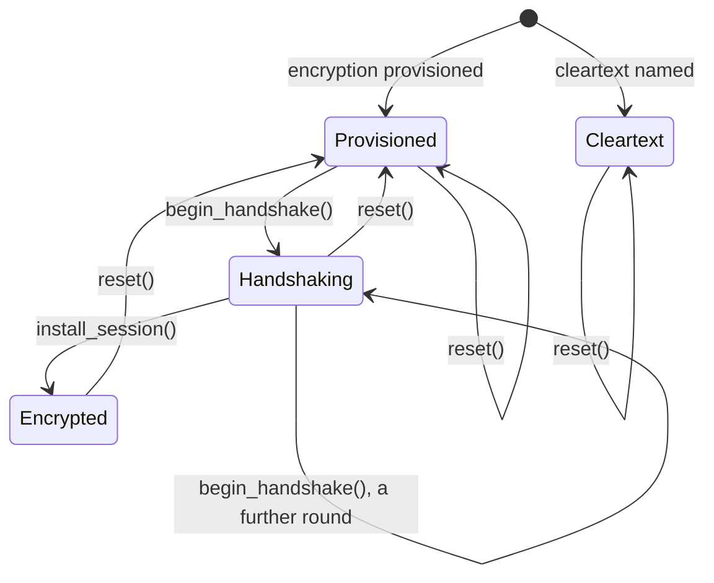
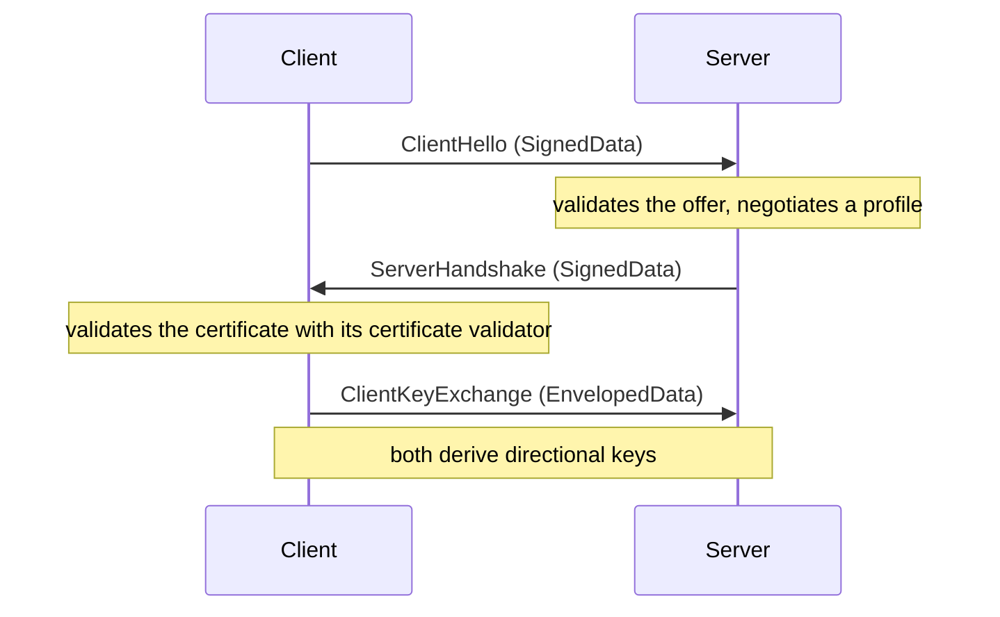
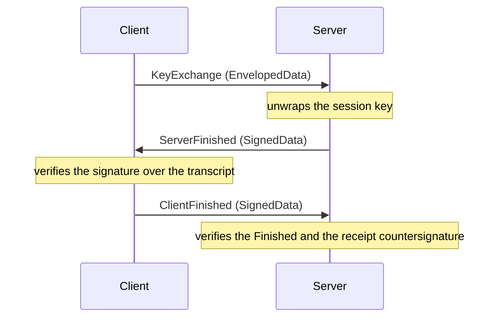
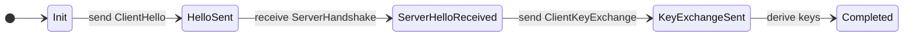
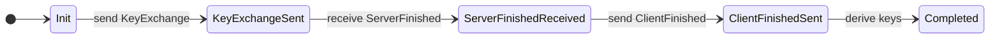
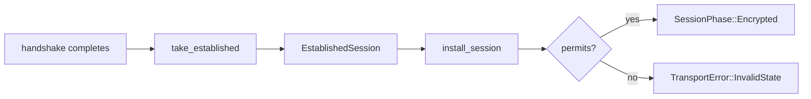
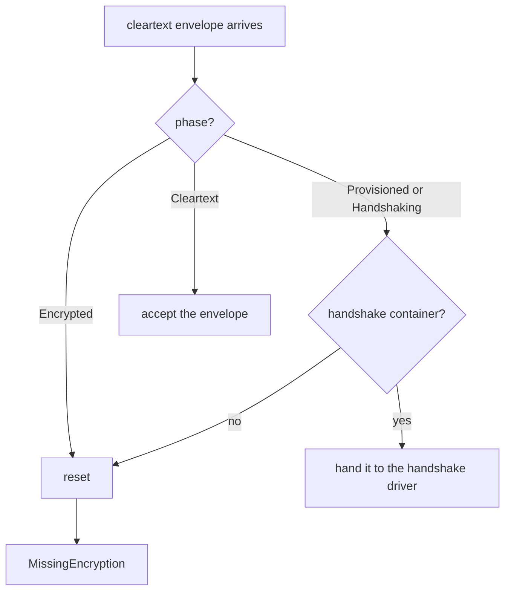

# The TightBeam Handshake

This document describes how a TightBeam session is established, which types carry that work, and which states the design refuses to represent. It covers the transport and handshake layers.

## Contents

- [Two protocols, one interface](#two-protocols-one-interface)
- [The session phase](#the-session-phase)
- [Message flow](#message-flow)
- [Handshake state machines](#handshake-state-machines)
- [Completion](#completion)
- [Peer authentication](#peer-authentication)
- [Transcript binding](#transcript-binding)
- [Failure and the circuit breaker](#failure-and-the-circuit-breaker)

## Two protocols, one interface

TightBeam ships two handshake backends. ECIES is the lighter one and tunnels its own message types inside CMS containers. CMS exchanges those containers directly as a key-transport handshake, so the client encrypts the session key to the server's certificate in its first message.

Both backends meet the transport at one interface, so the driver moves a handshake message without knowing which protocol produced it. Each container travels as a `WireDer`, which keeps the decoded value together with the bytes it was encoded or received as.

```rust
pub enum HandshakeMessage {
    /// Carries an ECIES `ClientHello` or `ServerHandshake`, or a CMS Finished.
    SignedData(Box<WireDer<SignedData>>),
    /// Carries an ECIES `ClientKeyExchange`, or a CMS key exchange.
    EnvelopedData(Box<WireDer<EnvelopedData>>),
}
```

Each step accepts one container and refuses the other. A step asks for the one it expects, and a peer that sends the other receives `HandshakeError::UnexpectedContainer`.

```rust
let key_exchange = msg.enveloped()?;   // refuses a SignedData
let finished = msg.signed()?;          // refuses an EnvelopedData
```

Because the orchestrator names its own container, the driver carries no per-protocol mapping. `ClientBuilder`, the connection pool and the `client!` macro all reach the same code.

## The session phase

A transport holds one `SessionState`, which pairs the endpoint's provisioning with one `SessionPhase`. The phase is the single record of where a session sits, and once encrypted it carries everything the handshake agreed.

```rust
pub enum SessionPhase {
    Cleartext,
    Provisioned,
    Handshaking { initiated_at: MonotonicInstant },
    Encrypted(Box<EstablishedSession>),
}
```

Carrying the session inside the phase means a half-installed session cannot be represented, and leaving the phase drops every term together.

An endpoint that holds encryption material starts in `Provisioned`, and an endpoint that named cleartext starts in `Cleartext`. The provisioning fixes that start, and a reset always returns the session to it. A further handshake round keeps the `initiated_at` of the first round, so a slow peer cannot stretch the handshake deadline by one allowance per round.


```mermaid
stateDiagram-v2
    [*] --> Provisioned: encryption provisioned
    [*] --> Cleartext: cleartext named
    Provisioned --> Handshaking: begin_handshake()
    Handshaking --> Handshaking: begin_handshake(), a further round
    Handshaking --> Encrypted: install_session()
    Encrypted --> Provisioned: reset()
    Handshaking --> Provisioned: reset()
    Provisioned --> Provisioned: reset()
    Cleartext --> Cleartext: reset()
```

`SessionPhase::admits` holds this table, and `SessionState::apply`, the one writer of the phase, consults it before writing. A move the table does not name leaves the session where it was and reports `false`, so a driver that attempts an out-of-order install fails with `TransportError::InvalidState` rather than proceeding.

| Attempted move             | Result  | Reason                                     |
| -------------------------- | ------- | ------------------------------------------ |
| `Cleartext -> Handshaking` | Refused | A cleartext endpoint holds no key material |
| `Cleartext -> Encrypted`   | Refused | No handshake ran                           |
| `Encrypted -> Handshaking` | Refused | A live session's keys would be dropped     |
| `Encrypted -> Encrypted`   | Refused | Keys would be replaced silently            |
| `Provisioned -> Encrypted` | Refused | The handshake never started                |

## Message flow

ECIES exchanges three messages. The server answers the hello with its certificate and a signature, and the client replies with the encrypted session material.


```mermaid
sequenceDiagram
    participant C as Client
    participant S as Server
    C->>S: ClientHello (SignedData)
    Note over S: validates the offer, negotiates a profile
    S->>C: ServerHandshake (SignedData)
    Note over C: validates the certificate with its certificate validator
    C->>S: ClientKeyExchange (EnvelopedData)
    Note over C,S: both derive directional keys
```

CMS exchanges three messages as well, but the client leads with the key exchange because the session key travels encrypted to the server's certificate.


```mermaid
sequenceDiagram
    participant C as Client
    participant S as Server
    C->>S: KeyExchange (EnvelopedData)
    Note over S: unwraps the session key
    S->>C: ServerFinished (SignedData)
    Note over C: verifies the signature over the transcript
    C->>S: ClientFinished (SignedData)
    Note over S: verifies the Finished and the receipt countersignature
```

The CMS server settles the receipt in the same round that receives the client Finished, so a budget-bearing session activates only after the countersignature verifies.

## Handshake state machines

Each protocol supplies its own transition table through a sealed trait, so a CMS peer cannot take an ECIES edge.

```rust
pub trait HandshakeFlow: sealed::Sealed {
    fn client_permits(from: ClientHandshakeState, to: ClientHandshakeState) -> bool;
    fn server_permits(from: ServerHandshakeState, to: ServerHandshakeState) -> bool;
}
```

The ECIES client machine runs the hello first.


```mermaid
stateDiagram-v2
    direction LR
    [*] --> Init
    Init --> HelloSent: send ClientHello
    HelloSent --> ServerHelloReceived: receive ServerHandshake
    ServerHelloReceived --> KeyExchangeSent: send ClientKeyExchange
    KeyExchangeSent --> Completed: derive keys
```

The CMS client machine leads with the key exchange.


```mermaid
stateDiagram-v2
    direction LR
    [*] --> Init
    Init --> KeyExchangeSent: send KeyExchange
    KeyExchangeSent --> ServerFinishedReceived: receive ServerFinished
    ServerFinishedReceived --> ClientFinishedSent: send ClientFinished
    ClientFinishedSent --> Completed: derive keys
```

`Completed` is the one terminal state. A refusal is the error the orchestrator returns, and the transport's session reset discards the orchestrator. Every edge is one the table names, so an out-of-order message returns `HandshakeError::InvalidState`.

| Backend | Client sequence                                                              | Server sequence                                                                  |
| ------- | ---------------------------------------------------------------------------- | -------------------------------------------------------------------------------- |
| ECIES   | Init, HelloSent, ServerHelloReceived, KeyExchangeSent, Completed             | Init, ClientHelloReceived, ServerHelloSent, KeyExchangeReceived, Completed       |
| CMS     | Init, KeyExchangeSent, ServerFinishedReceived, ClientFinishedSent, Completed | Init, KeyExchangeReceived, ServerFinishedSent, ClientFinishedReceived, Completed |

## Completion

A completed handshake hands over everything it agreed in one value. Completion moves the terms out of the orchestrator and moves its state machine to `Completed`, so the terms are read once and a second completion fails with `HandshakeError::InvalidState`.

```rust
pub struct EstablishedSession {
    keys: SessionKeys,
    mux: Option<MuxSettings>,
    receipt: Option<Arc<StoredReceipt>>,
    peer: Option<Arc<Certificate>>,
    epoch: Option<EpochMaterials>,
}
```

The fields are private, so outside the crate the session answers named questions instead: `keys()`, `mux()`, `receipt()` and `peer()`.

Each orchestrator exposes one completion, and the protocol trait delegates to it. A driver and a test therefore read the session terms the same way.

```rust
// The single home for CMS client completion.
let session = client.take_established()?;

// Through the trait, which consumes the boxed orchestrator.
let session = ClientHandshakeProtocol::complete(client).await?;
```

Installing that session is one phase write. The write bounds both session ciphers by the endpoint's encrypted-envelope ceiling, so every install keeps the per-key volume inside the AES-GCM bound.

```rust
fn install_session(&mut self, session: EstablishedSession, encrypted_envelope: usize) -> bool {
    let bounded = session.with_envelope_ceiling(encrypted_envelope);
    self.apply(SessionEvent::Install(Box::new(bounded)))
}
```

The certificate and the receipt travel as `Arc`, so completion copies neither.


```mermaid
flowchart LR
    A[handshake completes] --> B[take_established]
    B --> C[EstablishedSession]
    C --> D[install_session]
    D --> E{permits?}
    E -->|yes| F[SessionPhase::Encrypted]
    E -->|no| G[TransportError::InvalidState]
```

## Peer authentication

An endpoint must establish something about its peer before it dials. A server certificate, a trust store, or a requirement for a client certificate each does. A client identity proves who the client is and says nothing about the server, so it does not count. An endpoint that holds none of the three, and did not name cleartext, is refused before any frame reaches the wire (CWE-295).

```rust
pub fn check_dial_permitted(&self) -> TransportResult<()> {
    if !self.is_provisioned() && !self.allow_cleartext {
        return Err(TransportError::PeerAuthenticationUnconfigured);
    }

    Ok(())
}
```

`DialableEncryption::new` runs this check, and every `SessionState` is built from a `DialableEncryption`. The builder, the connection pool, the colony dialers and the `client!` macro are therefore all covered by one check.

A frame reaches the wire through one of two places, and each carries the decision already made:

| Writer | What closes it |
| --- | --- |
| `apply_wire_mode` | Reads the phase. `Encrypted` sends under the session key, `Cleartext` sends in the clear, and a pending handshake fails with `EncryptorUnavailable` |
| `TransportWriter` | Takes its mode from the phase at `into_split`. An encrypted half owns the send key, a cleartext half comes only from a `Cleartext` phase, and a pending handshake refuses the split |

Running without authenticating the peer stays available as a named choice.

```rust
let client = ClientBuilder::<TokioListener>::builder()
    .allow_cleartext()
    .build()
    .connect(addr)
    .await?;
```

| Configuration                          | Reaches the wire | Reason                                        |
| -------------------------------------- | ---------------- | --------------------------------------------- |
| Trust store                            | Yes              | The peer is authenticated                     |
| Client validators                      | Yes              | A mutual-auth server authenticates its client |
| Server certificate                     | Yes              | A server presents its own identity            |
| Client identity alone                  | No               | Nothing establishes who the peer is           |
| Client identity plus `allow_cleartext` | Yes              | The risk is named                             |

## Transcript binding

The CMS transcript hashes the container DER on both sides. The sender hashes the bytes it encoded, and the receiver hashes the bytes it received, so the binding is byte-level.

The pinned `der` decoder sorts a `SET OF` before validating it, so a mis-ordered set decodes to the same value as the well-ordered one. The receiver therefore hashes the bytes that arrived, through `WireDer::der` for a container and `HandshakeAttribute::received_bytes` for an accept attribute, instead of a re-encoding of the decoded value. A reordered set then diverges the two transcript hashes and fails signature verification (CWE-345). The ECIES transcript binds the `ClientHello` DER and the accept encodings the same way.

## Failure and the circuit breaker

`SessionState::reset` returns a session to its start. Because the phase carries the session, the reset drops the keys, the receipt, the peer certificate, the mux terms and the epoch materials together.


```mermaid
flowchart TD
    A[cleartext envelope arrives] --> B{phase?}
    B -->|Encrypted| C[reset]
    B -->|Provisioned or Handshaking| H{handshake container?}
    H -->|yes| I[hand it to the handshake driver]
    H -->|no| C
    B -->|Cleartext| E[accept the envelope]
    C --> D[MissingEncryption]
```

This matters for authorization. The colony gates and the cluster export rules read the peer certificate, so a session that was torn down must not leave the previous peer's identity readable.

An end of stream is named by the phase it interrupted. A peer that disconnects while a handshake is pending gives `PeerClosedBeforeHandshake`, and the same event on an agreed session gives `ConnectionClosed`, which is what a pool acts on when it evicts a connection.

## Sources

- RFC 5652, Cryptographic Message Syntax: <https://datatracker.ietf.org/doc/html/rfc5652>
- RFC 5280, Internet X.509 Public Key Infrastructure Certificate and CRL Profile: <https://datatracker.ietf.org/doc/html/rfc5280>
- CWE-295, Improper Certificate Validation: <https://cwe.mitre.org/data/definitions/295.html>
- CWE-311, Missing Encryption of Sensitive Data: <https://cwe.mitre.org/data/definitions/311.html>
- CWE-345, Insufficient Verification of Data Authenticity: <https://cwe.mitre.org/data/definitions/345.html>
